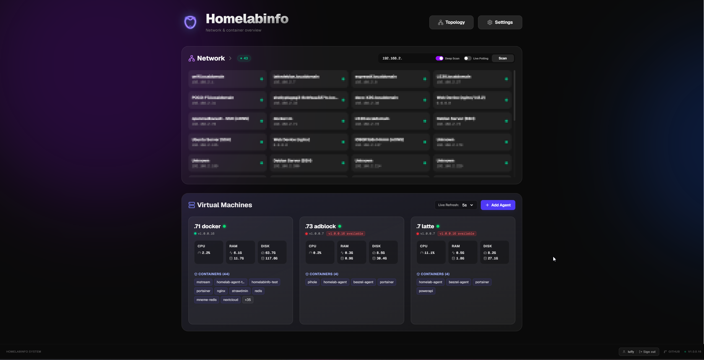
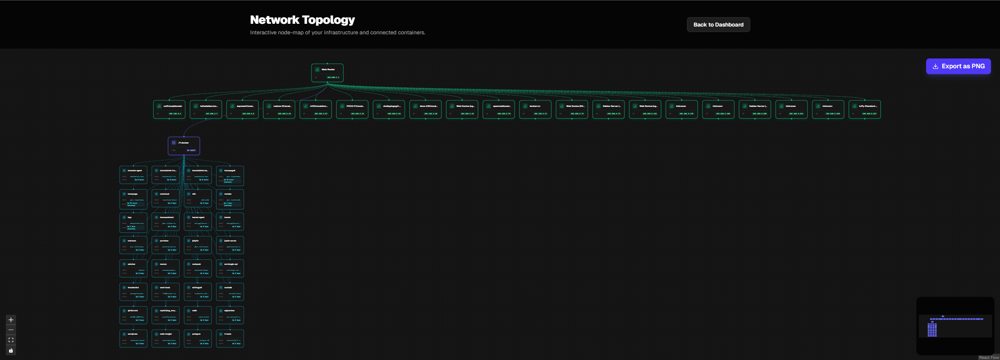
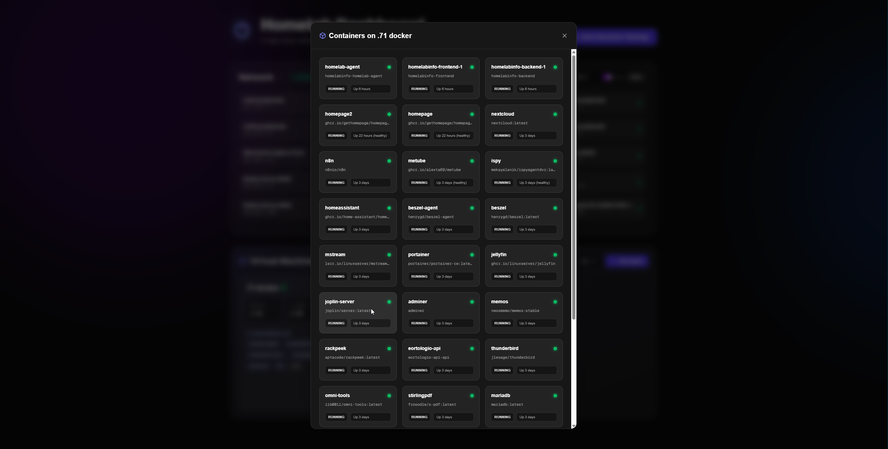
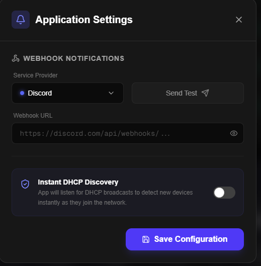

# HomeLabInfo

[](https://github.com/gregluffy/HomeLabInfo)


HomeLabInfo is a self-hosted, cross-platform network scanner and visualization dashboard designed to help you manage and map your homelab infrastructure.



It provides an intuitive interface to seamlessly discover devices on your local network, track their online/offline statuses, and persist a visual map of your network topology. Originally inspired by traditional Windows Forms network scanners, this modernized web-based solution brings homelab management into the browser.

### 🌟 Featured On
Featured on XDA Developers! Check out their coverage of HomeLabInfo:
* [This open-source dashboard gave me the unified view of my home lab I needed](https://www.xda-developers.com/open-source-dashboard-gave-me-unified-view-home-lab-needed/)

### Visualizing Your Network
Discovering and managing your devices is easier than ever with our interactive topology and container management views.

| Network Topology | Container Management |
| :---: | :---: |
|  |  |

### Key Features

*   **Instant DHCP Discovery**: Rapidly discover and identify devices the moment they connect and request an IP address, Sending an Webhook to inform you for the new connected client on your network and ensuring your device list is always up-to-date.
*   **Intelligent Network Mapping**: Continuously scan and track your homelab infrastructure online and offline statuses.
*   **Interactive Topology**: View and arrange a visual map of your network structure.
*   **Container Management**: Manage and monitor your Docker containers across different agents from one central UI.
*   **Detailed Documentation**: For full setup and usage instructions, refer to our [User Manual](USER_MANUAL.md).




## The Approach

As a developer primarily focused on **.NET**, this project is built from the ground up leveraging the power and cross-platform capabilities of **.NET 10**. Through containerization using Docker, HomeLabInfo can be easily deployed across various operating systems and architectures without worrying about environment-specific dependencies.

### Technologies Used

* **Built with:** .NET 10 (ASP.NET Core), Next.js, Docker.
* **Backend**: .NET 10 (ASP.NET Core / Worker Services)
* **Frontend**: Next.js (Modern Web Dashboard)
* **Agent System**: .NET 10 (For remote telemetry gathering)
* **Containerization**: Docker & Docker Compose
* **Database**: SQLite (For persistence)

## Why `network_mode: host` is Required

If you've looked at the `docker-compose.yml` file, you'll notice that the deployment relies on `network_mode: host` (or `network: host` depending on the syntax). 

This is a critical requirement for the network scanning functionality to operate correctly.

By default, Docker isolates containers inside their own virtual bridge network (e.g., `172.17.0.x`). If HomeLabInfo runs on this bridge network, any ARP requests, Ping sweeps, or broadcast packets will be limited to this virtual Docker network, returning no meaningful results about your actual physical (or primary virtual) network.

By setting `network_mode: host`, the Docker container skips the isolated bridge and directly uses the network interfaces of your host machine. This allows the .NET network scanner to:
1. Discover the true subnet range of your network.
2. Send ARP requests and receive replies from physical devices on your LAN.
3. Hear UDP broadcasts (like mDNS/Bonjour) properly.

Without host networking, the scanner simply won't see your homelab.

## Deployment

HomeLabInfo is designed to be deployed using Docker Compose. Depending on your setup, you can run everything on one machine or distribute agents across multiple servers.

### 1. Unified Deployment (Hub + Agent)
Use this if you want to run the dashboard and a local agent on the same machine.

1.  Download [docker-compose.yml](docker-compose.yml).
2.  Edit the environment variables:
    *   `API_URL`: Set this to `http://<your-server-ip>:9622/api`.
    *   `HUB_PUBLIC_KEY`: Keep this as `CHANGE_ME` initially, then update it with the key provided by the dashboard after the first run.
3.  Run the stack:
    ```bash
    docker compose up -d
    ```

### 2. Hub Only (Dashboard & Database)
Use this on your main server to manage multiple remote agents.

1.  Download [docker-compose.hub.yml](docker-compose.hub.yml).
2.  Update the `API_URL` variable.
3.  Run the hub:
    ```bash
    docker compose -f docker-compose.hub.yml up -d
    ```

### 3. Remote Agent Only
Use this on any machine or VM you want to monitor.

1.  Download [docker-compose.agent.yml](docker-compose.agent.yml).
2.  Go to your HomeLabInfo dashboard, add a new agent, and copy the **Public Key**.
3.  Paste the key into the `HUB_PUBLIC_KEY` environment variable.
4.  Run the agent:
    ```bash
    docker compose -f docker-compose.agent.yml up -d
    ```


## Contributing

Contributions are welcome! As this project is licensed under the GNU GPLv3, any modifications or improvements you contribute must also be released under the same license, ensuring the project remains free and open-source for everyone.

## Community & Feedback

HomeLabInfo is built for the community. If you have suggestions, feature requests, or find a bug, please:

- **Open an Issue**: Use the [GitHub Issues](https://github.com/gregluffy/HomeLabInfo/issues) to report problems.
- **Start a Discussion**: Share your setup or ideas in the [Discussions](https://github.com/gregluffy/HomeLabInfo/discussions) tab.
- **Contribute**: Pull requests are welcome! See the [Contributing](#contributing) section for more details.

---

## Security & Disclaimer

> [!CAUTION]
> **HomeLabInfo is designed for use on trusted local networks only.** 
>
> Because this application requires `network_mode: host` to perform network scanning, it has direct access to the host's networking stack. This significantly reduces the isolation typically provided by Docker.
> 
> *   **Do NOT expose this application directly to the internet.**
> *   If you need remote access, use a secure VPN (like WireGuard or Tailscale).
> *   The author provides this software "as is" without any warranties. Users assume all responsibility for any security risks or network issues that may arise from using this tool in their environment.

## License

This project is licensed under the **GNU General Public License v3.0**. See the [LICENSE](LICENSE) file for the full text.


